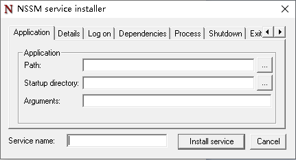
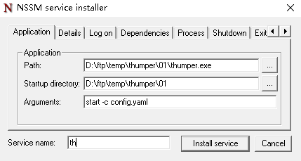

# Windows

## 服务注册(nssm)


在`Linux`系统中`systemctl`用于托管服务非常方便，在`Windows`中服务注册可以通过系统自带的`sc`指令添加，
不过要求运行的应用需要符合`Windows`服务相关标准,不过可以通过`nssm`等软件作为服务外壳，以减少跨平台调试成本。

### 快速使用

- 下载安装

	- 官网: https://www.nssm.cc
	- 下载地址: https://www.nssm.cc/ci/nssm-2.24-101-g897c7ad.zip

- 使用

	1. 解压文件
	1. **请以管理员身份**运行`cmd`或`PowerShell`并进入`win32`或`win64`目录。
	1. 在`cmd`中输入 `.\nssm.exe install`, 即可弹出以下图形界面, 其中`Path`为软件绝对路径,
		`Startup directory` 为工作目录, `Arguments` 为运行参数。
	
		

- 示例
	1. 示例介绍: `thumper`示例软件运行时需要`thumper.exe`与`config.yaml`,即一个运行时使用的`exe`
		可以执行文件，一个`yaml`配置文件, 在命令行模式中`thumper`示例软件运行完整命令为:
		`.\thumper.exe start -c .\config.yaml`
	
	1. 配置截图
		
		
	
	1. 点击`Install service` 后, 回到 `cmd`或`PowerShell` 输入下方指令出现**操作成功完成**, 说明成功。

		```shell
		PS C:\ ... \win64> .\nssm.exe start th
		th: START: 操作成功完成。
		```
	
	1. 也可以通`services.msc`查看服务状态。

	1. 通过以上方法注册的服务,特点说明:

		- 具有开机自启功能。
		- 具有失败自动重启功能并且没有延时，对于启动加载内容比较多的服务，建议添加重启延时。

### 常用指令

- 安装、编辑

	- 安装`nssm install`
	- 编辑`nssm edit 服务名`

- 启动、停止、重启、状态

	- 启动`nssm start 服务名`
	- 停止`nssm stop 服务名`
	- 重启`nssm restart 服务名`
	- 状态`nssm status 服务名`

- 删除、删除自动确认

	- 删除`nssm remove 服务名`
	- 删除自动确认`nssm remove 服务名 confirm`

### 安装脚本

- thumper
	
	::: details 点击查看完整安装脚本
	<<< @/src/code/cmd/install_service.bat
	::: 

### CMD脚本提权
> 依据空行可以把以上代码划分为4部分功能：
> - 第1部分，使用 cacls.exe 访问 system 注册表文件，得到一个返回值。
> - 第2部分，检测这个返回值是否是0，不为0表示访问失败，需要提升权限。
> - 第3部分，创建一个 getadmin.vbs 脚本文件，写入 用runas以管理员权限创建新的控制台 代码，
> - 运行这个vbs脚本文件，并退出旧的控制台。
> - 第4部分，删除vbs脚本，然后在新的控制台中，切换到当前的执行目录。
> - 第5部分, 需要提权的cmd

```shell
@echo off
:: BatchGotAdmin
:-------------------------------------
REM  --> Check for permissions
>nul 2>&1 "%SYSTEMROOT%\system32\cacls.exe" "%SYSTEMROOT%\system32\config\system"

REM --> If error flag set, we do not have admin.
if '%errorlevel%' NEQ '0' (
    echo Requesting administrative privileges...
    goto UACPrompt
) else ( goto gotAdmin )

:UACPrompt
    echo Set UAC = CreateObject^("Shell.Application"^) > "%temp%\getadmin.vbs"
    echo UAC.ShellExecute "%~s0", "", "", "runas", 1 >> "%temp%\getadmin.vbs"
    "%temp%\getadmin.vbs"
    exit /B

:gotAdmin
    if exist "%temp%\getadmin.vbs" ( del "%temp%\getadmin.vbs" )
    pushd "%CD%"
    CD /D "%~dp0"
:--------------------------------------
@echo on
.\\thumper.exe uninstall
pause
```

