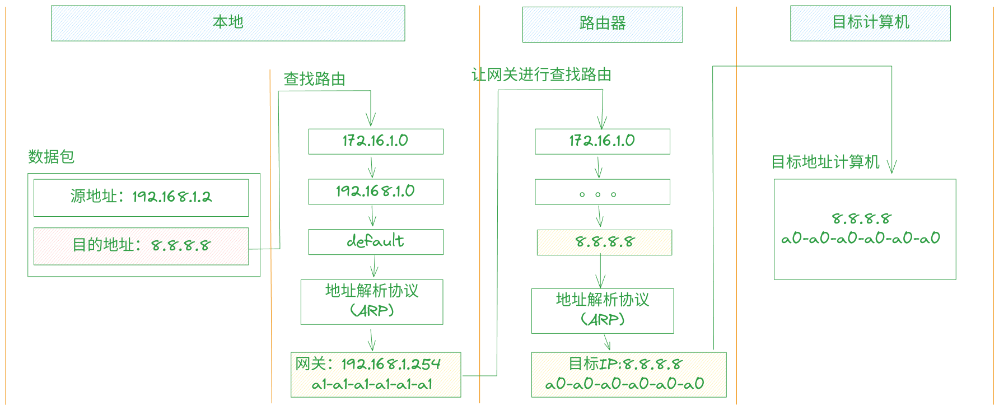

# arp 与 路由表

:::warning 注意
以下有提到`windows`修改路由信息的，都需要使用管理员权限
:::

## 路由工作示意


## 路由表

### 查看路由表

- **Linux**查看路由信息 `route` 或使用 `ip route`

```shell
route
# 内核 IP 路由表
# 目标            网关            子网掩码        标志  跃点   引用  使用 接口
# default         _gateway        0.0.0.0         UG    100    0        0 enp4s0
# link-local      0.0.0.0         255.255.0.0     U     1000   0        0 enp4s0
```

- **Windows**中查看路由表 `route PRINT`

```shell
route PRINT
# 永久路由:
# 网络地址          网络掩码  网关地址  跃点数
# 				0.0.0.0          0.0.0.0   192.168.12.254     默认
```


### 添加临时路由

- **Linux**出现`172.16.1.*`目的地址时通过`192.168.1.2`开寻找。

```shell
sudo ip route add 172.16.1.0/24 via 192.168.1.2
```

- **Windows**中: 出现`172.16.1.*`目的地址时通过`192.168.1.2`开寻找

```shell
route add 172.16.1.0 mask 255.255.255.0 192.168.1.2
```

### 删除路由

- **Linux**中: `sudo ip route del <目标网络> via <网关>`,
如 `sudo ip route del 172.16.1.0/24 via 192.168.1.2`

- **Windows**中: `route delete 172.16.1.0`


### 添加长效路由

- **Linux**中建议添加在`netplan`配置文件中

```yaml{12-16}
# This is the network config written by 'subiquity'
network:
  ethernets:
    eno8303:
      addresses:
      - 192.168.42.23/24
      gateway4: 192.168.42.254
      nameservers:
        addresses:
        - 8.8.8.8
        search: []
      routes:
        - to: 172.16.1.0/24
          via: 192.168.1.1
        - to: 10.10.10.0/24
          via: 192.168.1.2
    eno8403:
      dhcp4: true
  version: 2
```

- **Windows**中: `route -p add 172.16.1.0 mask 255.255.255.0 192.168.1.2`
