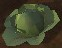
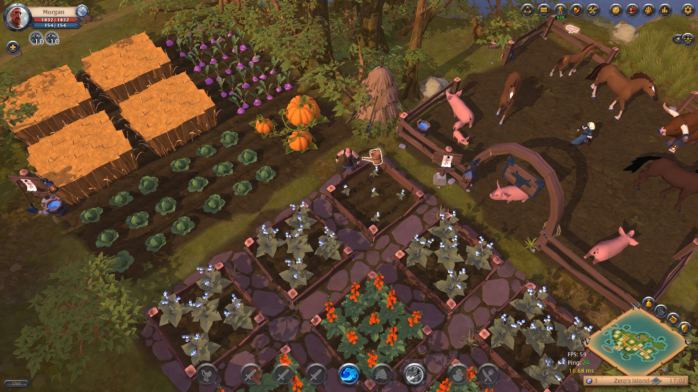
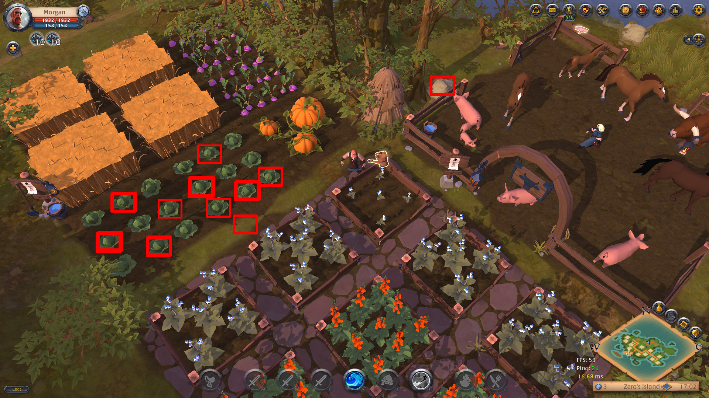

# 多个对象的模板匹配

:::tip 参考内容
- **opencv 官方文档**: https://docs.opencv.org/4.8.0/d4/dc6/tutorial_py_template_matching.html

- **Learn Code By Gaming(YouTuBe)**: https://www.youtube.com/watch?v=ffRYijPR8pk

- **Learn Code By Gaming(github)**: https://github.com/learncodebygaming/opencv_tutorials
:::

## 效果及准备文件

- 准备`albion_farm.jpg` 与 `albion_cabbage.jpg`图像并放在 `./match_multiple` 目录中,运行代码后生成`result.png`

	| 图像  | 
	| :-------------: |
	|  albion_cabbage.jpg |
	||
	|  albion_farm.jpg |
	||
	| **生成效果**, result.png |
	||

## 代码

<<< @/src/code/opencv/match_multiple/demo1.py
