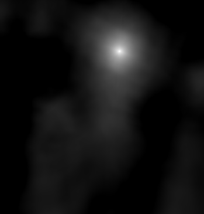
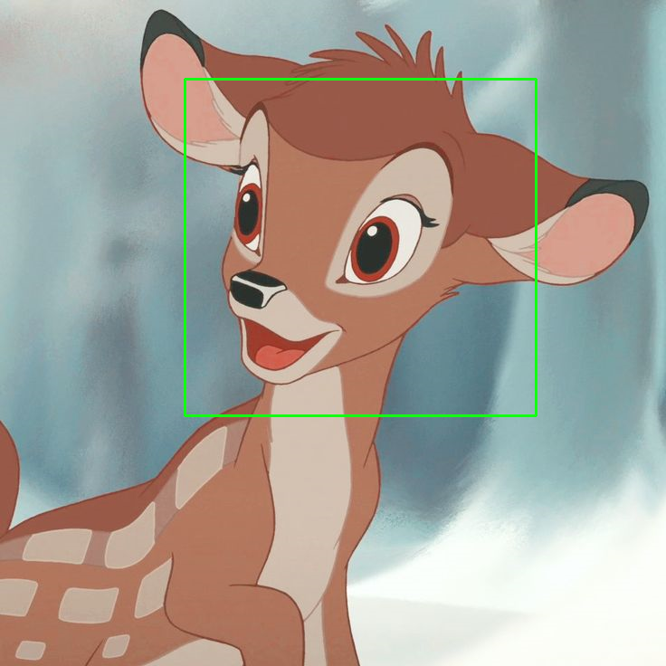

# 快速开始

## 虚拟环境及安装

- 虚拟环境

	```shell
	# 创建虚拟环境
	virtualenv venv
	# 激活虚拟环境
	source venv/bin/activate
	```

- 安装库

	```shell
	pip install opencv-python
	```


## Bambi 模板匹配

- 准备`bambi_temp.png` 与 `bambi.png `图像并放在 `./bambi` 目录中

	| bambi_temp.png        | bambi.png |
	| :-------------: |:-------------:|
	|  |  |

- 运行代码后生成以下图像

	| 匹配示意 | 框选匹配区域 |
	| ------------- |:-------------:|
	|  |  |

- 代码

	<<< @/src/code/opencv/bambi/demo1.py

## 错误处理

- 环境 `ubuntu 1804`、`Python 3.6.9` 

- 在 `cv.imshow` 时出错

- 错误信息

	```shell
	Traceback (most recent call last):
		File "demo2_match_multiple.py", line 16, in <module>
			cv.imshow('Farm', farm)
	cv2.error: OpenCV(4.8.1) /tmp/pip-install-l81yjbpj/opencv-python_63613bce6d2547a5893bf9d9440c254f/opencv/modules/highgui/src/window.cpp:1272: error: (-2:Unspecified error) The function is not implemented. Rebuild the library with Windows, GTK+ 2.x or Cocoa support. If you are on Ubuntu or Debian, install libgtk2.0-dev and pkg-config, then re-run cmake or configure script in function 'cvShowImage'
	```

- 解决方法

	```shell
	sudo apt install libgtk2.0-dev pkg-config
	pip install opencv-contrib-python
	```
