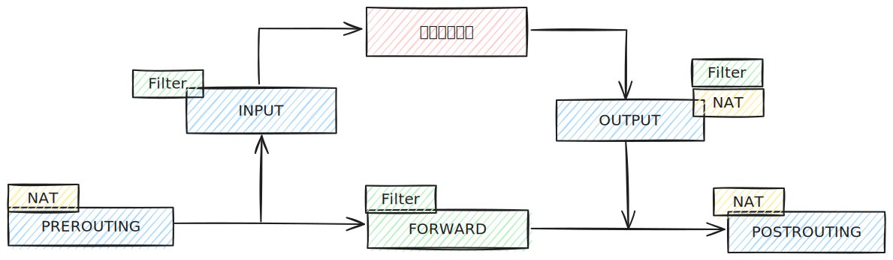

# iptables 防火墙

## 名词

- **表(table)**: 用于存放**链**
- **链(chain)**: 用于存放**规则**
- **规则(policy)**: 允许或拒绝条目

## 匹配规则

1. 规则是一条一条执行，无论是`DROP`拒绝还是`Accept`允许，都算匹配成功，
成功时后续规则不再继续执行，失败时会一条一条向下执行。
1. 如果都不匹配，会执行默认数量包规则。
1. 拒绝规则尽量放上面。


## 四表五链

::: tip 提示
没写到的说明不重要
:::

1. `filter`过滤表
	- `INPUT`过滤主机的数据包
	- `FORWARD`路过，转发数据包，与nat相关。

1. `nat`映射表
	- 共享上网（内网服务器上外网）
	- 端口映射和**ip**映射
	- `PREROUTING`作用于当数据包到达防火墙时，改变数据包的目的地址、目的端口等功能
	- `POSTROUTING`作用于执行规则之后，出站时，源地址被改为公网地址，**局域网共享上网**。

## 工作流程图



## 环境确认

```shell
# 查看是否包含iptable_filter,iptable_nat 
lsmod |egrep 'nat|filter'
# 查看当前规则
sudo iptables -nL
# 需要关闭当前系统的其他防火墙
# 如：centos 的 firewalld
```

## 实验

::: tip 提示
以下测试环境为: 
- 电脑A(防火墙机): `192.168.12.180`
- 电脑B(普通主机ssh电脑C): `192.168.12.183`
- 电脑C(测试机): `192.168.42.10`
- **电脑B**通过ssh连接**电脑C**后不停`ping`**电脑A**
:::

```shell
# 查看filter(默认表)的当前规则
sudo iptables -nL

# 查看指定表的当前规则iptables -nL -t 表名
sudo iptables -nL -t nat

# 屏蔽
sudo iptables -t filter -I INPUT -s 192.168.42.10 -j DROP
# > ping 会直接停住

# 删除一条规则
sudo iptables -D INPUT 1
# > ping 恢复

# 允许
sudo iptables -t filter -I INPUT -s 192.168.42.10 -j ACCEPT
# > ping 恢复

# 拒绝
sudo iptables -t filter -I INPUT -s 192.168.42.10 -j REJECT
# > ping 的提示会变成 Destination Port Unreachable

# 屏蔽一个网段
sudo iptables -t filter -I INPUT -s 192.168.42.0/24 -j DROP
# > ping 会直接停住

# 禁止192.168.42.0/24访问22端口
sudo iptables -t filter -I INPUT -s 192.168.42.0/24 -p tcp --dport 22 -j DROP
# > ping 可以通 ssh 会卡住
sudo iptables -t filter -I INPUT -s 192.168.42.0/24 -p tcp --dport 22 -j REJECT
# > ping 可以通 ssh 会提示 Connection refused

# 只允许指定网段接入
sudo iptables -t filter -I INPUT ! -s 192.168.12.0/24 -j DROP
# > ping 会直接停住

# 禁用ping 
sudo iptables -t filter -I INPUT -p icmp -j DROP

# 限制速率(令牌)
sudo iptables -t filter -I INPUT -p icmp -m limit --limit 10/minute -j DROP
# > ping 会被限速

# 修改默认规则
sudo iptables -P FORWARD ACCEPT
```

## 生产配置

```shell
# 允许 22 端口
sudo iptables -A INPUT -p tcp --dport 22 -j ACCEPT

# 允许回环
sudo iptables -A INPUT -i lo -j ACCEPT
sudo iptables -A OUTPUT -o lo -j ACCEPT

# 允许常见端口
sudo iptables -A INPUT -m multiport -p tcp --dport 443,80 -j ACCEPT

# 开放内网
sudo iptables -A INPUT -s 172.16.1.0/24 -j ACCEPT

# 放行连接状态
sudo iptables -A INPUT -m state --state RELATED,ESTABLISHED -j ACCEPT
sudo iptables -A OUTPUT -m state --state RELATED,ESTABLISHED -j ACCEPT
```

## 共享上网

- 防火墙
	
	- 配置防火墙SNAT规则

	```shell 
	sudo iptables -t nat -A POSTROUTING -s 172.16.1.0/24 -j SNAT --to-source 192.168.12.180
	```

	- 开启内核转发功能

- 客户端

	- 网关指向防火墙

## 端口映射

	
- 防火墙
	
	- 配置防火墙DNAT规则

	```shell 
	sudo iptables -t nat -A PREROUTING -d 192.168.12.180 -p tcp --dport 9000 -j DNAT --to-destination 172.16.1.251:22
	```

	- 开启内核转发功能

- 客户端

	- 网关指向防火墙
